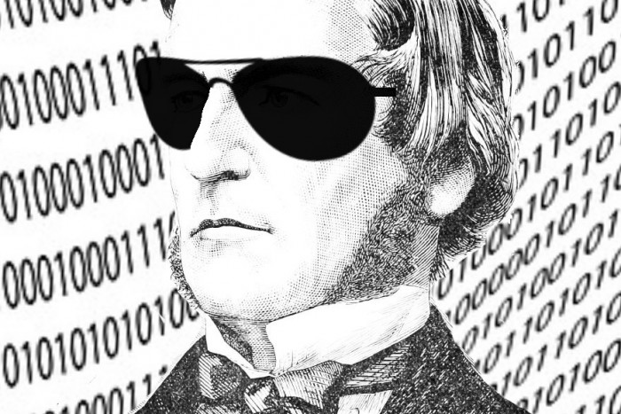

##### IF STATEMENTS, VARIABLES, INPUTS/OUTPUTS, BOOLEAN
Do you ever get stuck on a maths question and can't find your calculator?

Well, those days are over! Today, you are going to make a program that does difficult calculations for you! You'll input two numbers and tell the computer what you want to do with them (e.g. add them up or multiply them together).

## Task 1: Asking for the numbers
First of all, we need to be able to give the computer these numbers, to remember for later. In order to do this we must use **inputs** and **variables**. We use **inputs** so we can put the numbers we choose into the program and we use **variables** so we can save  them within the program, so they can be used later on. Just follow the steps below and you will be well on your way to creating your own calculator!

#### Step List:
* Open up your code editor of choice (e.g. Portable Python).
*  Type: `number1 = int(input("What is the first number?"))`
	* Remember to put the whole `input()` **function** inside the `int()` brackets as they tell the computer that the numbers you are inputting are actually numbers, not words!
	* Don't forget to use speech marks around `"What is the first number?"` as they tell the computer that the question you've written is made up of words, or in coding  terms, **strings**!
	* Make sure that there is no space between `input` and the bracket.
* Type: `number2 = int(input("What is the second number?"))`
	* Make sure that you close all brackets otherwise the code won't work!
* Your code should look like this:
```python
number1 = int(input("What is the first number?"))
number2 = int(input("What is the second number?"))
```

* Run the code!

When you run the program, it should ask you to input the first two numbers. If the program doesn't do this, something's wrong! Look over your code and make sure that it matches the code in the steps above.

## Task 2: Showing the numbers
Now that the user has inputted the two numbers they want to use, we are now going to simply output these numbers.

#### Step List:
* Open the code you made in **Task 1**.
* Below this code, type: `print("Number 1: ", number1)`
	* Don't forget to use the comma as it tells the computer to separate the **string** `"Number 1: "` and the **variable** `number1`.
	* Make sure that there is a space between the colon and the second speech mark `: "`.
* On a new line, Type: `print("Number 2: ", number2)`

Your code should now look like this:

```python
number1 = int(input("What is the first number?"))
number2 = int(input("What is the second number?"))
print("Number 1: ", number1)
print("Number 2: ", number2)
```  
* Run the code!

When you run the code and input the two numbers, the program should then output the two numbers you inputted.

## Task 3: Number crunching
Now that we have given the program the numbers we want, it's time for us to write the code code so the program can do calculations using these numbers. We are going to do this using **if statements**.

These are blocks of code that are run only **if** a condition is met, that means if the statement I make is `True`. For example, if I wanted to check **if** number 1 was greater than number 2, I would use an **if statement** containing a **Boolean operator**.

Boolean's a pretty cool word, in case you didn't notice, and just means making a comparison in statements, that can only have the value `True` or `False`. In Python we use things like **equals** `==`, **greater than** `>` or **less than** `<`. The steps below will show you how to use all of these programming techniques to create your calculator.

Boolean logic was invented by, mathematician, George Boole. Here's a picture of him for your entertainment.



<!-- Steps and reasons for doing it -->
#### Step List:
* Open the code you were working on in **Tasks 1 and 2**.
	* Don't forget to frequently save your work otherwise it'll be gone forever!
* Type: `command = input("What do you want to do with these numbers?")`
* On a new line, type:

```python
if command == "add":
	print(number1+number2)
```

Remember that you must have a colon on the end of the first line so that the computer knows that it is an **if statement**!

* Now let's make the computer recognise when to multiply, write something similar to before, but changing the **IF statement** to check whether the user entered `multiply`.

```python
if command == "multiply":
	print(number1*number2)
```

Make sure that there is an indentation in the second line so that the computer knows that the second line is part of the **if statement**!
* Run the code!
	* Try inputting "multiply" or "add" to see if the computer can correctly add and multiply the numbers!

## All the code!
This is what your final code should look like, the bits after the '#' are comments and show you what the code is doing. You don't have to use them in your code but it's super helpful when checking through!

```python
# Converts the user's input to an integer, and assigns to a variable
number1 = int(input("What is the first number?"))
number2 = int(input("What is the second number?"))
​
# Prints the numbers
print("Number 1: ", number1)
print("Number 2: ", number2)
​
# Assigns the user's input to a variable
command = input("What do you want to do with these numbers?")

# Check if the user entered the command 'add'
# It will continue if the the statement below is True
if command == 'add':
	# Prints the sum of the two numbers
	print(number1 + number2)

# Check if the user entered the command 'multiply'
if command == 'multiply':
	# Prints the product of the two numbers
	print(number1 * number2)
```

Congratulations! You've created your very own calculator using python! If you're still eager to code more, look at the challenge task!

## Challenge Task:
If you are reading this you have probably finished all of the tasks and you want a challenge. Well, you've come to the right place! The challenge task is to see if you can get your calculator to divide, subtract and even square!

* HINT: `/` is divide, `-` is subtract and `**2` means square.
