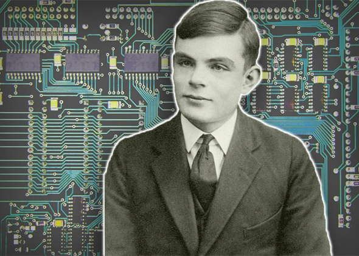

##### INPUT, OUTPUTS AND VARIABLES
From this lesson you should be able have a basic understanding of input, outputs and variables within python and also an insight to the Turing test.

## The Turing test
The Turing test was developed by Alan Turing in 1950. The test was a way of determining whether a computer is "intelligent".

Alan Turing is hailed as the father of modern computer science, so you best be thanking him!



#### So how does it work?
Behind one computer screen sits a human judge whose job is to communicate with interlocutors on the other side. Majority of those will be humans apart from one which will be a computer. the sole purpose of this computer will be to try and trick the judge into thinking that it is a real human. If the judge realises that the it is not human but in fact a computer it fails the Turing test. On the other hand if the computer does trick the judge it passes the Turing test.  

## Task 1: Inputs, variables and outputs
Your task is to create a simple program which asks the user their name, age and eye colour. All this information should be saved to variables and then printed by the computer in the following format `"NAME you are AGE years and have EYECOLOUR colour eyes"`.

```python
# Ask the user for name
name = input("What is your name?")

# Ask the user for their age
age = input("How old are you?")

# Ask the user for their eye colour
eyecolour = input("What colour eyes do you have?")

# Print and concatenate variables and strings
print (name, "you are", age, "years old and have", eyecolour, "colour eyes")
```
### So what's going on?
* Firstly the computer is taking user input, hence the use of the `input()` command.
  * The sentence in the speech marks, `""`, are what the user will see when the computer asks the questions.
* We have also saved to variables what the user inputs, for example the users name is saved to variable called name.
* Finally we have printed strings along with variables in order to create a sentence.
  * The words in quotation marks are strings and the words without quotation marks are the variable.
  * Make sure that the variable names are typed correctly otherwise the computer will not understand what to do.

### Syntax
Syntax is the set of rules that the computer uses to read your code when you press run. It is vital that you stick to the rules of the programming language so that your program will work, otherwise your computer won't be able to read it!

If you break the rules of the programming language, so that the computer can't read what you wrote properly, then it tells you off, by **throwing you an error**. This type of error, is called a **syntax error**.

If you miss out brackets or speech marks where there should be some, then you'll get a syntax error! The only way you can avoid them is by writing your code properly, and following the rules!

#### Error spotter: what kind of error is this, and where is it?
```python
size == input(What size feet do you have?)
print size
```
## Task 2: Talk to the computer!
In this task you will create a more complex program which will allow you to have a simple conversation with the computer.

* First of all, we need an input from the user.
  * Ask the user what there name is, and save this to the variable called `name`.
* On the next line of code, printing `"Nice to meet you"` and then the users name.
  * We print the users name by calling the variable: `name`.
  * When we type the variable name the computer prints the **value** that is stored in this variable.
* On the next 2 lines of code we are going to ask the user their age and date of birth, using the `input()` function.
  * Save their age to the variable name `age` and the date of birth is saved to the variable `dob`.
  * The age should be a number, so we can convert it by wrapping `int()` around it!

Now we have these variables we can use this data to print more complex sentences.

* The computer will print `"Wow you will be"`, followed by the users age in seconds.
  * In order to calculate the users age in seconds we have multiplied the variable by 365 (for each day of the year), then by 24 (for every hour in the day), then by 60 (for the minutes in an hour) and finally by 60 again (for seconds in a minute).
  * After this we have another string `"seconds old on"` and the users date of birth.

Here's an example of what could be outputted, if our name is `homebrew` and we are `11` years old and born on `23/02`:

```
Nice to meet you homebrew
Wow you will be 346896000 seconds old on 23/02
```

Try and use what you read in the first task to make this program if you're stuck! You only need to change a small part of the code...

Did you get something that looks like this? Hopefully!

```python
# Computer is asking what the users name is
name = input("Hi there what is your name?")

# Computer prints "nice to meet you" and the users name
print ("Nice to meet you", name)

# The user types a string, we convert it to a number with int()
age = int(input("How old are you?")) # Asks the users age

# Asks for the users birthday
dob = input("When is your birthday? (dd/mm)") # Asks for the users birthday

# Prints the user's age in seconds!
print ("Wow you will be", age * 365 * 24 * 60 * 60, "seconds old on", dob)
```


## Extension task 1
Now you understand how to make the computer reply through text! This program would certainly not pass the Turing test! Modify your code, to make it sound like you're talking to a person and not a computer.

## Extension task 2
Do some research into the first computer to pass the Turing test and when this happened. Instead of putting this into a PowerPoint or Word document, make a program that prints the information out to the user in Python!
