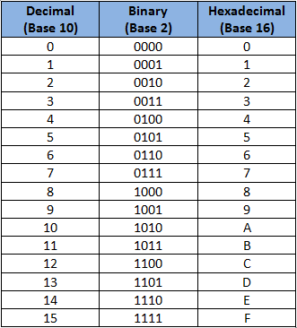

##### DICTIONARIES, FOR LOOPS & STRING MANIPULATION
What's Morse code? It's a method of sending text information as dots and dashes. It was used to send messages across huge distances, rather than sending letters (this was way before the internet, and even before your parents were born).

Since it's not used so often today, we don't really need to learn it. But what if we make an app that translates normal text to morse code? You could use this to send secret messages to your friends across a class room or whatever else you like!

Just to inform you, here's the translation of every letter to Morse code:


## Task 1: Making the computer remember Morse code
How can we make the computer store the Morse symbol (the dot and dash combination) of each letter?

You might be thinking about making a long array, with all the Morse symbols, or maybe using IF statements. These are good ideas, but we can make it easier than that!

What we need is a kind of dictionary, a reference when we can ask what the character's Morse symbol is, and translate back again. Hmm... If only Python had a dictionary type array!

Well we're in luck! Python has just that, it's called a **dictionary**, conveniently. We can make a type of **list** or **array**, where we have two values per space. We have a **key** and a **value**.

Here's what it looks like:

```python
firstDictionary = { "name": "Jack", "surname": "Homebrew" }
```
Do you remember how arrays work? We have an **index**, and a value. The **index** is a **key**, just like the key in a dictionary! Take note that a dictionary uses curly brackets, unlike the array or list, which uses square brackets.

> Remember it's a *key*, because it *unlocks* a value.

You can think of each section separated by a comma as a cell again. These cells are split into two halves; one (on the left), is your key.

**NOTE**: Keys can only be numbers or strings, or tuples!

This means that we can **refer** to the **value**, by using the key. In an array we might say `myArray[1]`, and similarly, with a dictionary we use our key inside the square brackets like `myDict["name"]` (this will print `Jack`.

#### Step List:
* Make a dictionary called `aboutMe` that stores your `"name"`, `"surname"` and `"age"`.
	* Remember that your age should be an integer, and not a string!
* Print out the details from the dictionary, so that at the **StdOut** (output), we see something similar to: `My name is Jack Homebrew, and I am 14 years old.`.
	* Remeber you can use commas to separate variables and strings inside the print function's brackets like: `print("I own", noAnimals, animal)`.

Also note, that like arrays, we can write dictionaries across multiple lines. The computer doesn't stop reading the dictionary until it sees the closing brace (bracket).

So ``firstDictionary`` could be written as:

```python
firstDictionary = { "name": "Jack",
					"surname": "Homebrew" }
```
* Update your dictionary with a friend's details, this is done like when we update an array. Try and work out how!
* Add a new field to your dictionary with the key: `"height"`, and the value of your friend's height. Do this without modifying your original dictionary!
	* Unlike arrays, we don't *append* values to a dict. We simply act as if we're updating a value, and the dictionary will automatically add it to the dict.
* Print your details again, but add some information about your height!

#### Really not sure? Here's some example code.
```python
aboutMe = { "name": "Jack",
			"surname": "Homebrew",
			# No speech marks because it's an integer!
			"age" : 14 } 	

# Printing the details
print("My name is", aboutMe["name"], aboutMe["surname"],
      ", and I am", aboutMe["age"], "years old.")

# Updating the values
aboutMe["name"] = "Cameron"
aboutMe["surname"] = "Junior"
aboutMe["age"] = 13

# Adding a new value
aboutMe["height"] = "134 cm"

# Printing information about the friend
print("My friend's name is", aboutMe["name"], aboutMe["surname"],
      ", and they are", aboutMe["age"], "years old.",
      "They are also", height, "tall!")

# Remember you can split the print function over multiple lines too!
```

## Task 2: Looping for each letter
Since Morse code is translated character by character, we need to translate character by character in our program too. Since we will be the same thing to each character for every character in the phrase (that means a predefined length), what could we use?

A FOR loop! Of course! Instead of iterating over a range of numbers, we will iterate over the characters of a word. We can do this really easily. Instead of ``for i in range(0, 10):``, we can use ``for letter in "string value":``.

* Remember that the `i` and the `letter` are just variables that we will use inside of our loop.
	* You can name them whatever you like, but outside of the loop, you can't access it!
	* The variable is updated after each loop.

In this task, we'll be converting letters to their hexademical values (confused? read on for details!).

#### Step List:
* Ask for a word from the user, and store this in a variable.
* Construct a for loop, that iterates over the letters in the user's input.
* Print the current letter (only) in the loop.
	* This means printing you should print the loop variable.

What do you see? Your word completely split up into lines for each character right?!

We're not going to translate to Morse code just yet, but we will convert to **hexadecimal**.

##### What's hexadecimal?
Hexadecimal (or hex, for short), is a number system. We use a decimal number system, meaning that we count from 0 to 9 and then we get to double digits. Computers count in binary, which is a base 2 number system. That means that computers count from 0 to 1, and then go into double digits.

Hexadecimal is a base 16 number system. That means that we count from 0 to 15, and then go into double digits. Since there aren't numbers with just one digits above 9, we use letters. The units column of hexadecimal can have the value: 0, 1, 2, 3, 4, 5, 6, 7, 8, 9, A, B, C, D, E, F. This also means that instead of a 10s column, we have a 16s number system.

This means that the number 15 is F, and 16 is 10. Confusing right? Don't worry about the details too much, because we'll get the computer to convert our letters into hexadecimal numbers. We use hex since it's so much shorter to write huge numbers!

Here's a table to show the basic conversion:




* Import the `binascii` package.
	* This should go at the top of your code!
* Try printing the value of `binascii.hexlify('Hello World!'.encode())`. We have to have a `.encode()` after our string to tell the computer to just use the byte values! You can't forget it, otherwise there will be an error.
	* Do you see how the numbers are printed out? These are the hexadecimal values of the letters you used!
	* We are using the `hexlify()` function of the `binascii` package here.
* Ask the user what they'd like to convert.
* Use your for loop to print the hex value of each character of the user's input.
	* Pretty cool right? Now this seems like computer talk!

#### Did we lose you at hexadecimal? Here's the code.
```python
import binascii

userWord = input("What would you like converted?")

# Remember the loop variable can be whatever you like
for char in userWord:
	# Variables make reading code easier
	# Just convert one letter of the input
	hex = binascii.hexlify(char.encode())

	# Print the hex value!
	print(hex)
```

Now we've learnt a bit about different number systems, and looping through

## Task 3: Translating to Morse code
So we can loop through characters in a string, and we can use dictionaries to store values and retrieve them later. What's left? Putting it all together of course!

We're not going to ask you to make a super long dictionary with all the Morse code, so here's one for you to copy into your program's code.

```python
morse = {' ': ' ',
        "'": '.----.',
        '(': '-.--.-',
        ')': '-.--.-',
        ',': '--..--',
        '-': '-....-',
        '.': '.-.-.-',
        '/': '-..-.',
        '0': '-----',
        '1': '.----',
        '2': '..---',
        '3': '...--',
        '4': '....-',
        '5': '.....',
        '6': '-....',
        '7': '--...',
        '8': '---..',
        '9': '----.',
        ':': '---...',
        ';': '-.-.-.',
        '?': '..--..',
        'A': '.-',
        'B': '-...',
        'C': '-.-.',
        'D': '-..',
        'E': '.',
        'F': '..-.',
        'G': '--.',
        'H': '....',
        'I': '..',
        'J': '.---',
        'K': '-.-',
        'L': '.-..',
        'M': '--',
        'N': '-.',
        'O': '---',
        'P': '.--.',
        'Q': '--.-',
        'R': '.-.',
        'S': '...',
        'T': '-',
        'U': '..-',
        'V': '...-',
        'W': '.--',
        'X': '-..-',
        'Y': '-.--',
        'Z': '--..',
        '_': '..--.-'}
```

Let's start off with using what we did before to make a line by line translation.

#### Step List:
* Ask the user for their phrase that needs translating.
	* We need to convert this to uppercase! As you can see, the Morse dictionary only has uppercase letters, if we use lowercase letters, there won't be a key to match it to. Morse code only uses uppercase letters, so convert the entire user input using `.upper()`, like `input("Question").upper()`.
* Construct a **for** loop to **iterate** through each letter.
	* We **iterate**, because we go round and round, and repeat our code!
	* A for loop is a program flow control structure, so it alters the way our program executes tasks.
* Get the value from the dictionary using the letter as the key.
	* Since the letter is a variable, don't put apostrophies around it in the square brackets!
* Print the Morse translation!

What if the user enters a value that's not in the dictionary? Such as '@' or '#'? We need to make sure our program is **robust**, and accounts for these inputs.

We can check if a key exists in a dictionary using ``"key" in mydict   ``. This will **return** ``True`` if it exists, and ``False`` if not. We could use an if and else statement to check if the letter exists in each loop.

We can do exactly the same thing with variables too. Say we have a variable, ``letter``, and we want to see if the value stored in ``letter`` is a key in the dictionary, ``mydict``. We would do the same thing as before, but replace the value (shown in speech marks before), with the variable name!

That means we would use: ``letter in mydict``. Simple! The output will be True of False again!

* Construct an if statement that passes if the key exists.
	* If the key is there, then translation is good to go on this letter!
* Add an else statement that causes the program to print `NO MORSE CHARACTER`.
	* If the key isn't there, we **fall through** to the else statement. Therefore there isn't a key, and we must tell the user that this character cannot be translated with our data.

Hopefully you've got something like this, under your mega-Morse-dictionary:

```python
normalPhrase = input("What would you like to translate?").upper()

for letter in normalPhrase:
	if letter in dict:
		translation = morse[letter]
	else:
		translation = "NO MORSE CHARACTER"

	# See how I saved lines of code?
	print(translation)
```

Great! This should print the translation for each letter on a new line. That's good, but let's make it into a long string, so that everything is printed on one line.

* Make an empty string before your loop.
	* We will be modifying it in the loop, therefore it has to have been **initialised** before.
	* Stuck? Assign it the value `""`.
* Change your current loop to add the `translation` to the empty string, rather than printing it each time.
* Print your previously-empty string after (that means outside) of the loop.
	* We print it outside, because other wise we would print bits of it lots of times, which is not what we want! We want to show the user their phrase once, and no more than once!

But now we have a problem that `NO MORSE CHARACTER` might be in the middle of our translation! If we can't find a character, let's tell the user that the translation failed. Only print the translation if everything went to plan!

* Create a **Boolean** value before the loop called ``transOkay``.
	* Set it to `True`. We use it at the end of our program to determine whether everything went to plan.
* Change the else procedure to update the value of `transOkay` to `False`.
	* We don't change it to True after a letter was translated normally, because a bad translation may have happened beforehand.
* Add an if statement after the loop to only print the translation if `transOkay` is `True`.
	* You can just use `if transOkay:`.
* Add a corresponding else statement to print out a message to the user to say that they included a character that couldn't be translated.

#### Did you get something similar to this?
```python
# Didn't include all the dictionary to save you space here
morse = { ... }

# Asking the user for their phrase and convert to CAPITALS
normalPhrase = input("What would you like to translate?").upper()

# Making an empty translation string so we can add to it later
translation = ""

# Start off assuming that everything went to plan
transOkay = True

# Loop through each letter of the user's phrase
for letter in normalPhrase:
	# If there is key in the dictionary
	if letter in morse:
		# The letter can be translated, and added
		translation += morse[letter]

	# If we can't translate it
	else:
		# Say something went wrong!
		transOkay = False

# Print error or translation
if transOkay:
	print(translation)
else:
	print("We couldn't translate some of your characters.")
```

### What we've learnt
We've learnt a bit more about FOR loops, and how they work when iterating through values. We've learnt the basics of dictionaries and how their useful. But most importantly, we've practiced our skills that we've learnt before.

Anothing important skill that you've been able to practise is error prevention! The last thing you'll ever want the user to see is the program break, so you've now learnt how to take measure to prevent that.

Now you've had a chance to see IF statements, FOR loops, string manipulation, arrays and dictionaries all in action, working with each other. You've learnt the basics of computer programming with Python and have been absorbing computer science along the way. Hopefully you can use all of these skills in some projects, and more specific lessons in the future.

Well done Junior Homebrewer!

## Challenge Task
1. Tell the user which letter caused the error.
2. Now we've got a transmitter (we can send messages), but what if we get Morse code back, how will we convert it back? Make a reverse converter, so that you can enter Morse code, as it will translate it into English.

#### Tips:
* Either write a reverse dictionary or iterate through the key-value pairs of the dictionary until you find your letter!
* Always Google and ask a teacher if you're stuck!