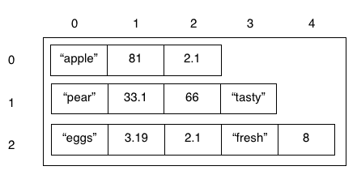

##### ARRAYS, OPERATORS, BOOLEAN & IF STATEMENTS


Shopping online is a little different to shopping in store. No dragging around heavy metal baskets, and you get to keep constant track of your bill. Since we know how to make **lists** (or arrays) now with Python, we know how to keep a list of items. Let's see if we can make our own virtual shopping system. Note: Sadly no customers will be paying you at the end. And no free food.

We'll be making an app where users choose which items they want, and how many, and then we tell them what they ordered, how much it will cost them, and tell them if they can (to prevent us selling products that are out of stock).

## Task 1: Making our list of items and their details
<!-- Break into paragraphs -->
To tell the customer what they can buy, we must be able to show them a list of all the possible items that they can purchase. You hopefully know how to use arrays to do this, but we'll just go over that for a short reminder.

<!-- Steps and reasons for doing it -->
#### Step List:
* Make a variable to store your item list.
* Assign the variable you just made with an array with all your items.
	* E.g. ``itemList = ["Bananas", "Eggs", "Milk"]``
	* Remember that items in an array need to be separated with commas, ``,``.
	* Also, since we're storing a string, it must have speech marks around it: ``"Milk"``.

Okay so now we have our items, but we don't have any other details. How do you think we could store the other important details, such as **price**, and **quantity**?

Remember that these properties are linked to each item, so putting them all in one mega-array would be unorganised! (and we're computer scientists, so everything needs to be tidy!
**Don't do:** ``itemList = ["Bananas", 1.30, 20, "Eggs",  2.00, 50, "Milk", 2.10, 10]``

What if we stored these details in mini arrays?  
**Like:** ``item1 = ["Bananas", 1.30, 20]``

Remember to add some comments using the ``# This is a comment! ``.

Did you know what can store arrays **inside** of other arrays?

* You can think of these like layers, or **dimensions**.
* A single array is kind of like a long line, or one row of a table or grid. A **two-dimensional** array is like a grid, with rows and columns. A **three-dimensional** array is like a cube; and it doesn't stop there!


* Make an array that holds a little array inside it, for every item in your list.
	* You can't forget your commas! Arrays are **objects**, just like strings, and integers.

This is a little complicated, so here's an example of what it should look like in your code.

```python
itemList = [["Bananas", 1.30, 20],
			["Eggs",  2.00, 50],
			["Milk", 2.10, 10]]
```

* I've decided to write the array across multiple lines, so that it's easier to read for humans.
	* The computer only thinks it's finished reading an array when it sees the corresponding, closing, square bracket: ``]``.
* So now we know how to make a multi-dimensional array, it's quite easy to understand.
	* It's quite simply just a big array that has arrays as the values stored inside it! A lot easier than you thought I bet!
* Try printing your array. If you made any **syntax errors** (that's where the computer can't read your code properly, because you haven't written it properly), those will be brought up!


#### Mini-challenge
Try to print just one part of the whole array, i.e. just the details of one item. You should be able to do with

## Task 2: Access the details
<!-- Break into paragraphs -->
To make our app useful, we have to be able to access each item's details induviually. This is so that we can work out useful things like left over stock, sums and more!

We have to be able to get the value of part of the array or list. This is only slightly different to how we get array cell values in a one-dimensional array!

#### Step List:
* Print the whole array of your first item.
	* If you need a reminder, I would do it like: ``print(itemList[0])``.
		* Remember that computers start at 0!
	* What we are doing here, is getting the value at **index** 0. That means, if we give each space in an array a value from 0 to n (n being the length of the array minus 1), we have a way to refer to the cells. This is the same as the index in a book, which tells you which page a certain term or word appears.
	* In arrays, the index is our **reference** to the cell. Imagine the computer starts by looking at the first cell (the 0th index). The index then tells it how many cells away the value it's looking for is!
		* Therefore here, I **refer** to **index 0** of the array **itemList**.
* Now that we've reminded you of that, print the 2nd value (that means refering to the first index).
	* See how simple that is? Hopefully it makes sense!

Now it gets a bit more complicated. We know how to get values from an array with one dimension. But how do we do it with two?

**We just give a second-level index.**

Imagine a grid. The first index refers to which row we want to go to, and the second says which column. So in the two-dimensional array below, if I want the value "tasty", then I go to index 1 (the 2nd row), and *then* index 3. If you've done geometry, it's similar to co-ordinates (except when we image inner arrays as rows, we go down, and then across).



How do we write this? Here's an example where we print the first value of the first array.

```python
itemList = [["Bananas", 1.30, 20],
			["Eggs",  2.00, 50],
			["Milk", 2.10, 10]]

# This should print "Bananas"
print(itemList[0][0])
```
* Try printing the price of eggs (2.00), using indexing.
* Change the quantity of Milk from 10 to 3.
	* You should know how to change the value of a cell in a regular array.
		* If you don't, here's a hint ``itemList[0] = "Changed!"``
	* Using what we just learnt, you should be able to have an educated guess. Often in computer science, we have to make an educated guess about how to solve a problem like this one!
* Print out your new array!

#### Couldn't work it out?
```python
itemList = [["Bananas", 1.30, 20],
			["Eggs",  2.00, 50],
			["Milk", 2.10, 10]]

# This should print "Bananas"
print(itemList[0][0])

# Milk quantity is changed
itemList[2][2] = 3

print(itemList)
```
<!-- Explain the computer science -->
What we've done here may seem simple, but you now know how to manipulated complex data structures! What that means is that you know how to change and use values that are stored in more complicated objects, such as arrays. Pretty cool eh?

## Task 3: Making an item basket
appending to an array

The user will want to know what they've paid for at the end of the shop, and what's in the basket. We can keep track of this using a data structure, in this case, we'll use an array.


### Task list:
* Get back up your original item list.
* Make an empty array, and call it ``item1``.
	* We are going to ask the user how many of an item they want, and then add the item, quantity and total cost to the user's basket.
* **Append** the value ``"Bananas"`` to the first index of the array.
	* Try doing this without typing the word, reference the cell in the ``itemList`` array!
	* Appending to an array mean adding to the end. We can append like this: ``myArray.append("A value!")``. This isn't the exact code however! Try and work out how we can append to our empty ``item1`` array.
* Try printing your array before appending a value, and afterwards.

See what happened? This is very useful, because we can't use ``myArray[0] = "value"`` until we have a value at the 0th index of the array!


* Ask the user what how many, for example, bananas, they want to buy, and update the cell for quanity using their input.
	* Can't remember how to ask the user? Here's a hint: ``input("How many bananas do you want?")``
	* You can append this directly to the quantity cell, but that makes things more complicated to use, and difficult to read. Assign the input to a variable first, and then append the variable to the array.
* Now let's work out a price. We can take the quanity that user wanted, and multiply it by the price in our original item array.
	* Can you do this without writing the value out again? Try and reference the price from the original array using it's index.
* Multiply that price by the quantity, and assign the total cost to the price cell in our new array.
* Print your new item!

Are you finding this task harder? Less code hints make it more difficult! Hopefully you're practicing your problem solving skills here.

Here's some of the code, to make it easier:  

```python
itemList = [["Bananas", 1.30, 20],
			["Eggs",  2.00, 50],
			["Milk", 2.10, 10]]

item1 = []			
item1.append(itemList[0][0])

# Printing the array as a demonstration
print(item1)

# Asking the user for the amount
quantity = input("How many bananas would you like?")
item1.append(quantity)

# The cost must be the amount times the price
totalCost = quantity * itemList[0][1]
item1.append(totalCost)

print(item1)
```

Did you know why we consistently referenced cells from the ``itemList`` array? What happens if the price of bananas changes?

By referencing to the original array, if anything does change, then we can just update it in the original array. This saves us having to look everywhere in case we have an old value that messes up our calculations.

* Change the quantity of the item in the ``itemList`` array accordingly. That means taking away our quantity from the array value.
	* We can use the ``-=`` operator, instead of saying ``itemList[0][2] = itemList[0][2] - quantity``. It's neater!
* Do the same for the customer's wallet, update the value to remove cost of the products.

```python
itemList[0][2] -= quantity
```

Now that we understand how to add to arrays, we can start protecting the store from greedy customers!

## Task 4: Deciding what to do
What happens if a customer wants to buy 1000 eggs, and we only have 20 in stock? We need to tell the customer that they can't buy this many, and only give them what we have. What if we run out of money in our wallet?

There are lots of "what if" problems, which is why we'll use if statements to solve them.

### Task list:
* Ask the user how much money they want to spend, and store it in a variable called ``wallet``.
	* A variable is vital here, as we need to update the value of their wallet everytime they buy something.
* Make a new, empty array called ``basket``
	* You could change these variable names, but it's good practice to call them something useful.
* Copy across your original item list.
* For every item in your list, do something similar to the last task. I.e. Make a smaller array for it, ask the user how many they want, and work out how much it will cost, **but don't add these values to the array yet.**

Hopefully you've come across if statements in the club before, they're super useful. Computer scientists call them program flow control structures, because they can control what our program does next (because they can skip stuff out, and do extra things, remember).

##### We have a few things to do:
* We need to check if the cost is greater than the user can afford.
	* If it is, then we need to work out how many they can afford, and tell them.
* Check whether we, the shop, have enough stock.
	* If we don't then we can only sell what we have, so we need to work out home much that will cost.
* If they have the money, and we have the stock, then we're ready to go and can add the items to their basket, and take the money from their wallet!

When planning something that involves lots of if statements, it's often easiest to do it with pen and paper!

Using what we know, let's start typing this out is pseudo code. That means it's not real code that a computer will be able to read, but it has the logic of a real program.

By pseudo coding our app, we are **breaking our problem down**, so we know which tasks we need to tackle!

Pseudo code:

```
if wallet has more money than the cost and requested less than the stock:
	add item to basket
	update stock
	take money out of wallet
	continue shopping
else, if they just requested more than stock:
	add all of the stock to basket
	update stock
	take money from wallet
	continue shopping
else (they must have less more than the cost):
	divide the money by the cost (leaving the remainder aside) to work out the max they can afford
	add the amount they can afford to the basket
	take money out of wallet
	update stock
	continue shopping
```

Wow that does look complicated!

Well, we know the amount of money in their wallet, that's stored in the variable ``wallet``, and we know the cost of the item, that's in the array ``itemList`` at index 0, 1, but will have to be multiplied by the ``quantity`` requested.

We know the amount they requested, that should be stored in the variable ``quantity``, and we know how much we have in stock. That should be stored in the ``itemList``, at 0, 2.

So we have everything we need!

* Store the single item price in a variable with an appropriate name.
	* We won't be needing to change the price in the original array from within our program, so using a secondary variable is alright!
* Write a **Boolean comparison** of the value of the ``wallet`` is **greater than** the ``quantity`` times the price.
* Write a **Boolean comparison** of the ``quantity`` being less than the stock in the ``itemList``.


Hopefully you've got something like:

```python
singleItemCost = itemList[0][1]
totalCost = quantity * singleItemCost

wallet > totalCost

quantity < itemList[0][2]
```

Now we can wrap these statements up into our if statement. We can use the ``and`` operator to check if both are true (at the same time).

```python
totalCost = quantity * singleItemCost

if wallet > totalCost and quantity < itemList[0][2]:
	# Do stuff!
```

Now try and write the other comparisons like we did in the pseudo code! Remember the ``elif`` statement! And never forget your identation and colons with these statements, Python will never forgive you!

Just put a comment in each indented space for now, the last part we will cover in the next task.

## Task 5: The checkout counter
Hopefully you've managed to lace together the if statements, and you've got something similar to:

```python
singleItemCost = itemList[0][1]
totalCost = quantity * singleItemCost

if wallet > totalCost and quantity < itemList[0][2]:
	# Do stuff!
elif quantity > itemList[0][2]:
	# Can't give them what they want.
else:
	# They can't afford it!
```

Let's look back at the pseudo code for when everything goes well:
> 	add item to basket,
	update stock,
	take money out of wallet,
	continue shopping

We can just take what we wrote in task 3 for that! Copy it over!

In the else if statement, we do pretty much the same, except we need to make the quantity that they're buying equal to our stock. That means we have to update the final price too!

* Try and implement that, there is code later but have a go alone!

In the final else statement, we need to work out how many they can afford. We could divide their money by the cost of the item, but we'd be left with a nasty remainder most of the time.

But Python lets us work out the remainder when dividing! We use the ``%`` operator, instead of the ``/``.

* Try printing the remainder of 7 divided by 3.
	* ``print(7 % 3)``

If we take the remainder away from the customer's wallet value, and *then* divide the wallet by the price, we can work out amount they can buy!

```python
remainder = wallet % singleItemCost
quantity = (wallet - remainder) / singleItemCost
totalCost = quantity * singleItemCost
```

* Make a variable called ``remainder``, and assign it the remainder of dividing the ``wallet``, by the item cost.
* Assign the ``quantity`` variable, the value of dividing the wallet minus the remainder, by the cost.
	* Be careful! We don't want to take away the remainder from the variable ``wallet``, like ``wallet -= remainder``! We don't update the wallet yet or we'll have some angry shoppers!
* Now just proceed as normal, working out the cost, taking that away from the wallet, updating the stock and adding the items to their reciept or basket!

You've done a lot this time, be proud! Don't worry if you got lost, just have a look at the code below and work out where you went wrong.

## Shopping complete.
```python
itemList = [["Bananas", 1.30, 20],
			["Eggs",  2.00, 50],
			["Milk", 2.10, 10]]

basket = []
wallet = input("How much would you like to spend today?")

# Make a new array to store this item's details
item1 = []
item1.append(itemList[0][0])   # Add the item name to the array

# Asking the user for the amount
quantity = input("How many bananas would you like?")

totalCost = quantity * itemList[0][1]
singleItemCost = itemList[0][1]
# If everything is fine, then sell!
if wallet > () and quantity < itemList[0][2]:
	 # Tell the user what's happening!
	print("Purchase is all good.")

	# Add the details to the reciept
	item1.append(quantity)
	item1.append(totalCost)

	# Take the money and the stock
	wallet -= totalCost
	itemList[0][2] -= quantity

# If we don't have enough
elif quantity > itemList[0][2]:
	# Tell the user what's happening!
	print("We don't have enough stock, we'll add what we've got.")

	# We have to update our values
	quantity = itemList[0][2]
	totalCost = quantity * singleItemCost

	# Add the details to the reciept
	item1.append(quantity)
	item1.append(totalCost)

	# Take the money and the stock
	wallet -= totalCost
	itemList[0][2] -= quantity

# Else, they can't afford it!
else:
	# Tell the user what's happening!
	print("You can't afford all of these items!")

	# Doing perfect division
	remainder = wallet % singleItemCost
	quantity = (wallet - remainder) / singleItemCost
	totalCost = quantity * singleItemCost

	# Add the details to the reciept
	item1.append(quantity)
	item1.append(totalCost)

	# Take the money and the stock
	wallet -= totalCost
	itemList[0][2] -= quantity


```

### Final tasks:
* Append your item to the basket when you're ready!
	* Think about where this could go. Try add it to the basket just once in the program!
* Copy and paste the code, and update it for each item.
	* If you know how to use ``FOR`` loops, then use them! It will be far easier to look at, and a lot less code!
* Print the user's reciept (that should just be the ``basket`` at the end, and leave them a nice message.

Hopefully you'll just be adding:

```python
# Adding the item to the basket
basket.append(item1)
basket.append(item2)
basket.append(item3)

# Printing the reciept
print(basket)
```

We've managed to use everything that we know about asafpjsdklgsa...


## Challenge Task
1. Print the total cost of the shop when you print the reciept.
2. What if the user decides, last minute, that they don't want some of their items! Update the program to remove items from their basket, and the cost from their reciept if the user doesn't want an item anymore. Complicated but you should have all the skills!

You can always take your code home to work on, and if your teacher's nice then you might even get a prize for going the extra mile!
