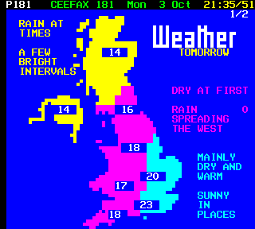

##### FUNCTIONS
 In this lesson we will learn what a function is, how use a function and also how to create one. 



## What is a function?
A function is a block of code which performs a desired task for example some code that can calculate the amount of calories burnt on a run.

### Who cares?
Firstly once the function has been created it can be called anywhere in the program. This means that time will be saved when you need to use the function as you will not have to write out the entire code again but can just simply call the function. It also makes your code more efficient and easier to read as you only need to write one line of code to use a function.

## Task 1: Create your first function
Here's how to create (or *define*) your first function!

* Firstly you need to type `def` followed by the name of the function. e.g. `def calorieFunction():`
* We put the brackets at the end as in here we place our parameters this can be inputs or arguments needed for the function for the work.
* Next we add the colons in order to tell the computer that we have created a function.
* Below this we type the code we wish the computer to execute, but make sure this code is indented otherwise the computer will not know to execute that code.

Now we have created the function lets see how we call one:

* Write the function name followed by two brackets again containing the needed parameters or arguments. e.g. `calorieFunction(workoutType)` 
	* This line of code will call the function along with the variable "workoutType" which would be needed in order for the function to work.

Type the code below and run it and see what error you get:

```python
# Ask the user their age in years and store in the variable "age"
age = int(input("How old are you?")) 

# Create a function called "ageSeconds"
def ageSeconds(): 
	# Create a new variable for your age in seconds
	ageSeconds = age * 24 * 60 * 60 * 365
	
	# Prints the user's age in seconds
	print(ageSeconds)

ageSeconds() # Call the function
```

### The error
In order for the function to work we need the required parameters to be included when we define the function. Therefore we need to put the variable "age" in both brackets for the function to be able to use this data.

**So lets try again:**

```python
# Ask the user their age in years and store in the variable "age"
age = int(input("How old are you?")) 

# Create a function called "ageSeconds", passing a parameter, 'age'
def ageSeconds(age): 
	# Create a new variable for your age in seconds
	ageSeconds = age * 24 * 60 * 60 * 365
	
	# Prints the user's age in seconds
	print(ageSeconds)

ageSeconds(age) # Call the function
```

### So what's going on?
- On the first line we are asking the user to input their age, we then save this value as an integer to the variable name "age".
- Next we have created the function and called it "ageSeconds", on this line of code we have also told the function what variable is going to be used so that the computer knows where to obtain the information.
- After this we created a new variable called "ageSeconds" which is the users age in seconds, we have done this by using the variable containing the age and timesed it by 60 then by 60 then by 25 and then by 365.
- We then told the computer to print the users age in seconds on the screen so they are able to see it.
- The final line of code allows this function to be executed as functions only start to work when they are told to do so therefore we have to tell the computer to do so.

We now know how a function works and the basics as how to create and use them.

## Task 2: What to wear with different weather
In this task you will create a variety of functions that will be executed depending on different criteria. From this task we will see that you can create a function and then use this throughout the program which will save time writing out each piece of code again and again.

```python
weather = input("What's the weather today? (sunny/rainy/cold/hot/sunny+cold/rainy+hot)")
def sunny():
  print("Make sure you wear sun cream today!")

def rainy():
  print("Bring an umbrella with you today.")

def cold():
  print("Make sure you wrap up and keep warm")

def hot():
  print("You can wear shirts and t-shirt today")

if weather == "sunny":
  sunny()
if weather == "rainy":
  rainy()
if weather == "cold":
  cold()
if weather == "hot":
  hot()
if weather == "sunny+cold":
  sunny()
  cold()
if weather == "rainy+hot":
  rainy()
  hot()
```

### So what's going on?
on the first line we are inputting today's weather by typing one of the words provided by the computer for example "sunny". After this we define all of our functions for all the different weather types. After this we make our criteria, the computer checks what the user inputs and calls a function depending on that input. For example if the user inputs sunny+cold then the functions sunny and cold are called this is shown below in the block of code.

```python
if weather == "sunny+cold":
	sunny()
	cold()
```
## And we're done!
You now understand what a function is, how to create one and also how to use it. We have seen examples of its uses. We have a variety of programming techniques, if statements, functions, user input and also printing.

