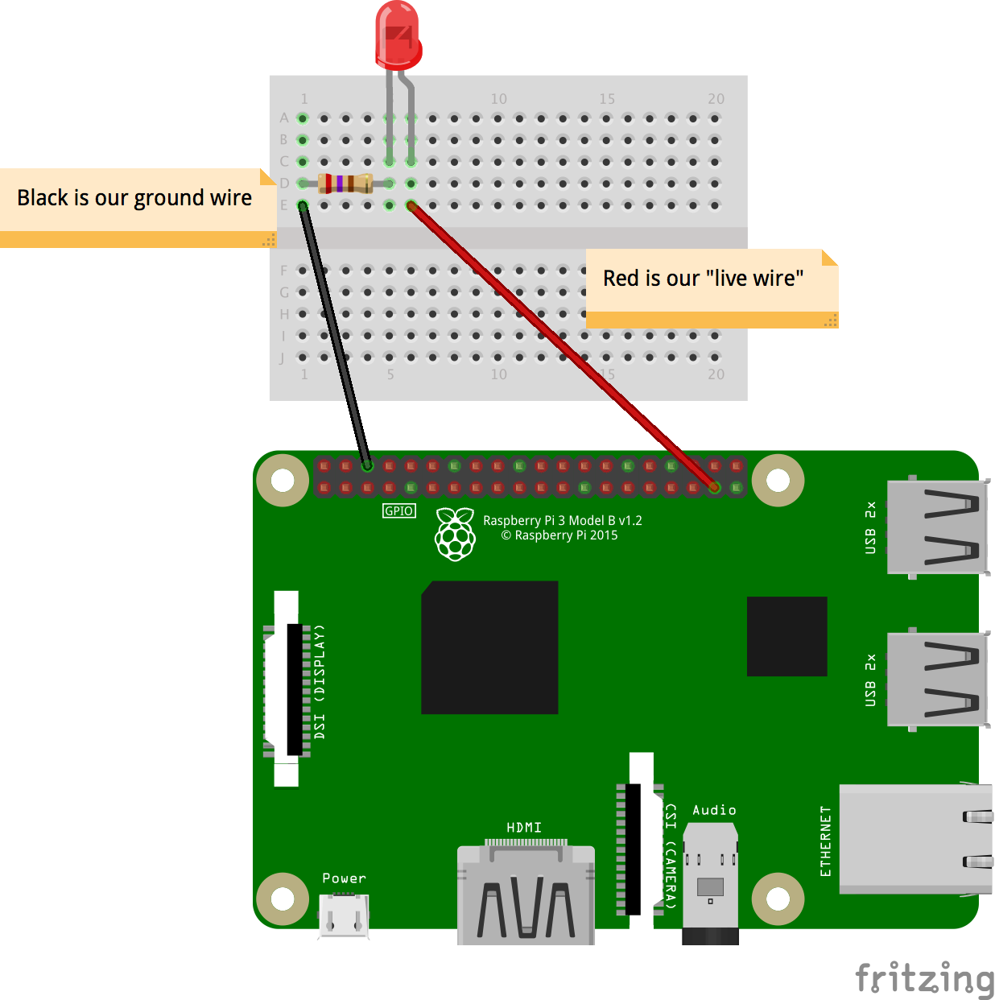
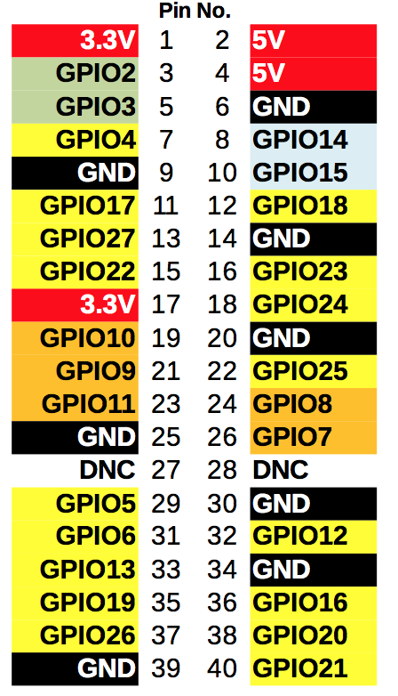
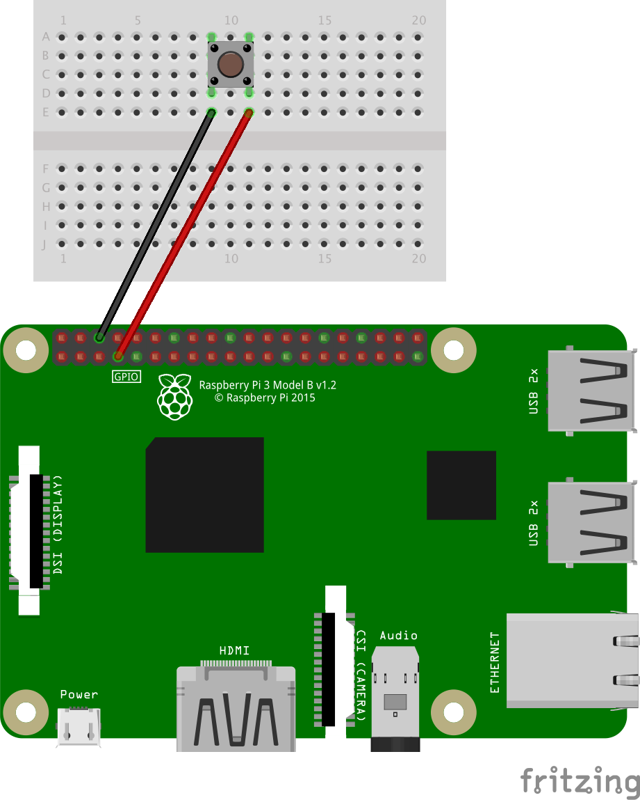

##### DICTIONARIES, FOR LOOPS, ARRAYS, GPIO & RASPBERRY PI

Last time we used Morse code, we were just encoding plain English into the dots and dashes that makes up Morse code. That was interesting, but wasn't very useful to communicate. If we could use Morse code, to send flashes of light across the room, we could communicate easily!


This lesson, we'll be learning how to use LEDs (little lights) and buttons with the Raspberry Pi. Later on, we'll use those electronics to transmit and record Morse code messages!

## Task 1: Using LEDs with the Raspberry Pi
LEDs are little light bulbs that we can use really easily with the Raspberry Pi. They're very delicate, so we have to protect them with a resistor (to stop too much electricity passing through it). Hopefully your teacher has already set up the LEDs, but if not, here's a diagram!



We will be using a **library** called ``gpiozero``. This makes using LEDs and buttons a whole lot easier!

Let's start off by turning an LED on and off after 1 second using Python. This will help us send our Morse code out later!

First, we'll need to import out LED module from ``gpiozero``. 

```python
from gpiozero import LED
```

We will also need the ``time`` module, to make the Raspberry Pi wait.

```python
from gpiozero import LED
import time
```

Now let's get coding! We need to make a variable that tells the computer how the Raspberry Pi is connected to the LED. 

The Raspberry Pi has a series of pins poking out of it, as you can probably see (but don't touch!). These are called **GPIO pins** – they're the way the Raspberry Pi can make things happen in the real world. 

Each **GPIO pin** has a number. The numbering system is a bit weird, but this diagram should help. If your Raspberry Pi is set up correctly, it should have 2 wires connected to it. 



**It must have both wires connected!** One is the "live wire", whilst one goes to ground (coloured in black, and labelled 'GND'), so that we have a complete circuit. 

What we must tell the Raspberry Pi is which pin the 'live wire' is attatched to. It should be one of the pins labelled with GPIO at the beginning!

Let's make our variable, that will tell the computer which pin is connected to the LED. 

Using the original wiring diagram, it should be pin 26 (labelled GPIO26 on the second diagram). 

```python
myLed = LED(26)
```

This is a normal variable, as we've seen in lessons before. It stores the LED information, and lets us control the LED by **referencing the variable**.

If we want to **turn the LED on**, we can use:

```python
myLed.on()
```

If we want to **turn it off**, we can use:

```python
myLed.off()
```

If we want to make the computer wait a certain amount of seconds (e.g. 1 second), before continuing the program, we can use:

```python
time.sleep(1)
```

### Tasks
* A single blink
	* Try making the LED flash on, wait half a second, and then flash on again!
* 4 blinks (but no copy and pasting!)
	* Remember **for loops**? They let us repeat a block of code over and over again for a certain amount of times. 
	* Can't remember the code? Here's the start of a **for loop** that repeats 3 times: ``for i in range(0, 4):``
* Blink function
	* If you can remember, or are feeling confident, then try and make a function that makes the LED blink on and off. 
	* You start a function (e.g. called, `blink`), with: ``def blink():``

## Part 2: Using buttons
We don't just want to send Morse code, but we also want to be able to record the code, just like old machines!


Let's start by connecting up our button to our Raspberry Pi using the same **breadboard** that we used for the LED!



Again, we're using `gpiozero`. But this time, we're using the `Button` module. 

Start a new Python file, and let's get started! Import Button from the gpiozero library.

```python
from gpiozero import Button
```
Again, we need to tell the Raspberry Pi which **GPIO pin** the button is connected to. Remember, it's the 'live wire' that we're looking for!

Using the original diagram, that should be pin 4. Let's make a variable, similar to the way we registered the LED last time. 

```python
from gpiozero import Button 

# This button is connected to pin 4
myButton = Button(4) 
```

Last time, we had to use the `time` library to make the Raspberry Pi wait. Now, we can tell the Raspeberry Pi to wait until the button is pressed! It's really simple. 

Here's a demo of how we can make the Raspberry Pi print something when the button is pressed down.

```python
myButton = Button(4)

# Wait for the button to be pressed...
myButton.wait_for_press()
# The Raspberry Pi won't get beyond this point until the button is pressed
# We have to wait...

# Then print this line! (after the button was pressed)
print("The button was pressed!")
```


### Tasks
* Flash an LED when the button is pressed
* Make the LED turn off when the button is pressed, and stay on when it's not.

Another tip: to wait until the button is released, we can use: `myButton.wait_for_release()`.

---
# More to come!